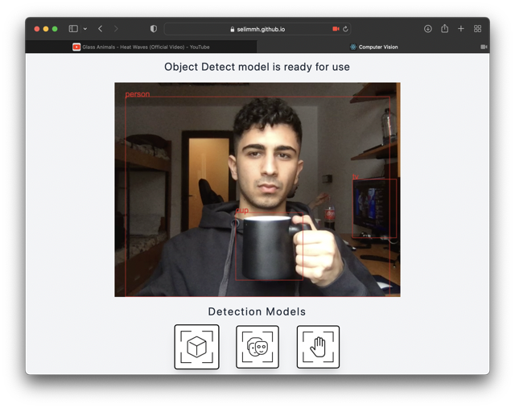

<!-- Title -->

# COMPUTER VISION

<!-- About -->

### About The Project

Computer Vision software to detect objects, human hand and to render human face landmark. Check it out [Here](https://selimmh.github.io/computer-vision)

#

### Preview

#

### Author Info

Hi 👋  
I am _Selim_

My website - [www.selimmh.me](https://selimmh.me)  
Twitter - [@selimmh0](https://twitter.com/selimmh0)  
LinkedIn - [@selimmh](https://www.linkedin.com/in/selimmh/)  
E-mail - [@selim.mht@gmail.com](https://mail.google.com/)

#

### Built With

- [React](https://reactjs.org)
- [TensorflowJs](https://www.tensorflow.org/js)
- [Tensorflow-models/coco-ssd](https://github.com/tensorflow/tfjs-models/tree/master/coco-ssd)
- [Tensorflow-models/face-landmarks-detection](https://github.com/tensorflow/tfjs-models/tree/master/face-landmarks-detection)
- [Tensorflow-models/handpose](https://github.com/tensorflow/tfjs-models/tree/master/handpose)
- [TailwindCSS](https://tailwindcss.com)

#

### Important Dependencies

- [react-spinners](https://www.npmjs.com/package/react-spinners)
- [react-webcam](https://github.com/mozmorris/react-webcam)

#
